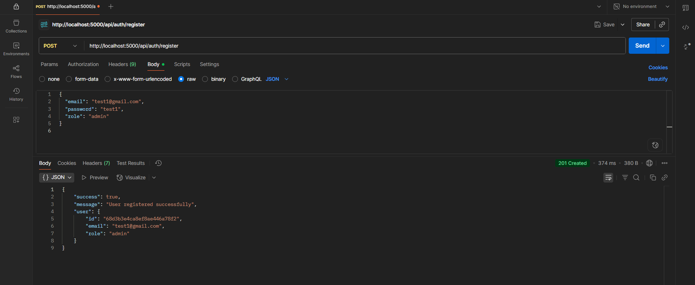
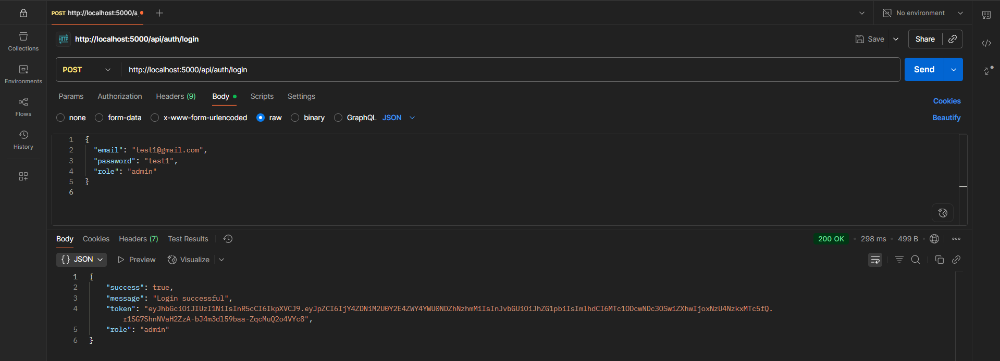
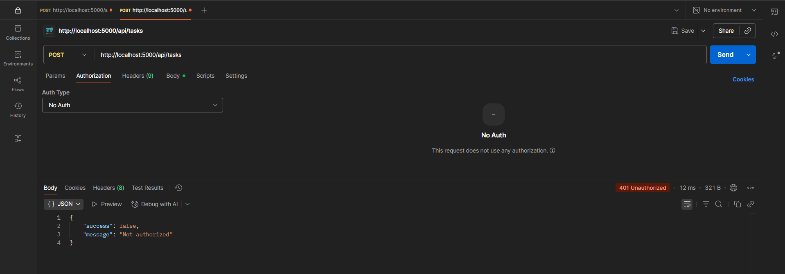
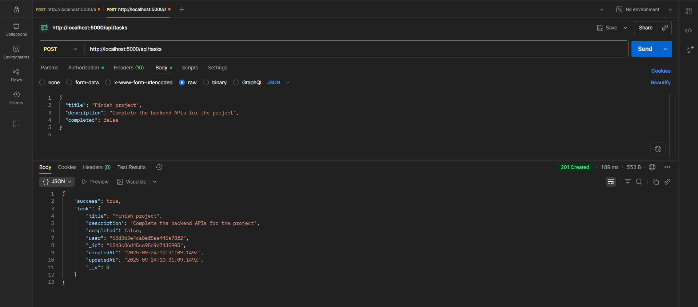
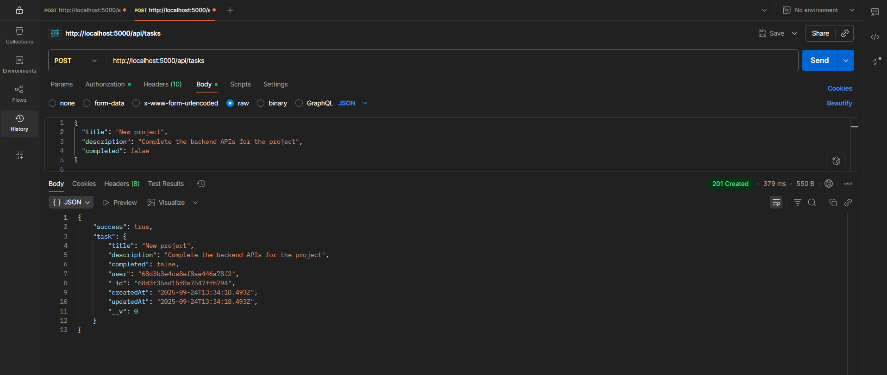
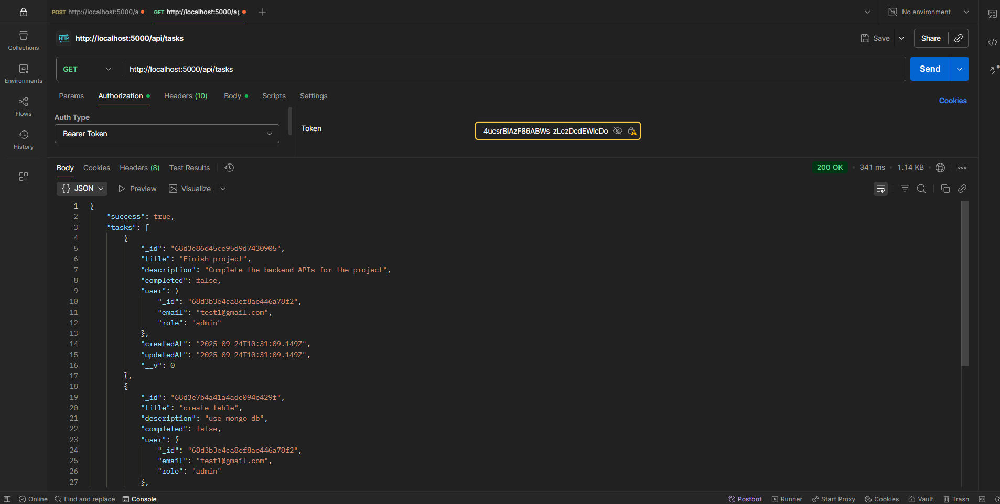
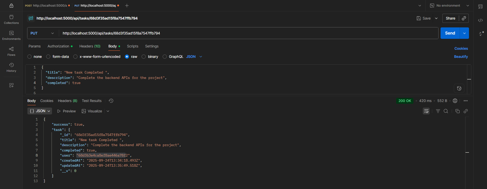
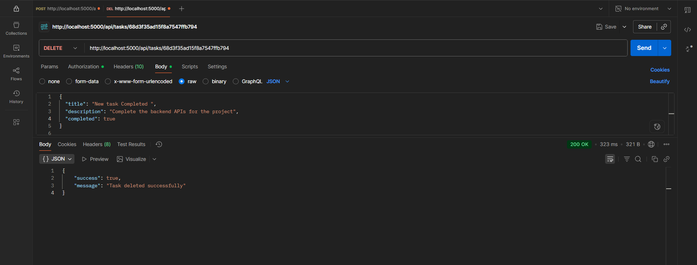

# PreTrade — Backend (Express + MongoDB)

Backend for **PreTrade**: an Express + MongoDB (Mongoose) API providing JWT authentication, role-based access control (RBAC) and a Task CRUD API (each task owned by a user).

---

## Quick links (screenshots)

> All images are stored in the `backend/images/` folder.

**Sign up / Sign in**







**Task requests / responses (auth enforced)**











---

## Features

* User registration & login with **bcrypt** password hashing
* **JWT** tokens for authentication
* RBAC: `user` and `admin` roles
* Task CRUD: create / read / update / delete
* Protected routes via middleware that verifies JWT and attaches `req.user`
* Clean, predictable JSON responses for success / errors

---

## Requirements

* Node.js v16+
* npm (or yarn)
* MongoDB (Atlas or local)

---

## Environment variables

Create a `.env` file in `backend/` with:

```
PORT=5000
MONGO_URI=<your_mongo_uri>
JWT_SECRET=<your_jwt_secret>
```

---

## Install & Run

```bash
cd backend
npm install

# start (development)
npx nodemon server.js

# or
node server.js
```

Server default: `http://localhost:5000`

---

## Folder structure (backend)

| Path                            | Type | Description                                                  |
| ------------------------------- | ---: | ------------------------------------------------------------ |
| `server.js`                     | file | App entrypoint — connects DB, configures middleware & routes |
| `.env`                          | file | Environment variables (not checked into git)                 |
| `models/`                       |  dir | Mongoose models                                              |
| `models/user.js`                | file | User schema (`email`, `password`, `role`)                    |
| `models/task.js`                | file | Task schema (`title`, `description`, `completed`, `user`)    |
| `controllers/`                  |  dir | Controllers with business logic                              |
| `controllers/authController.js` | file | `register` & `login` (hashing, token creation)               |
| `controllers/task.js`           | file | Task CRUD handlers                                           |
| `middleware/`                   |  dir | Express middleware                                           |
| `middleware/authMiddleware.js`  | file | JWT validation + attach `req.user` + role checks             |
| `routes/`                       |  dir | Express routers                                              |
| `routes/auth.js`                | file | `/api/auth` routes                                           |
| `routes/tasks.js`               | file | `/api/tasks` routes                                          |
| `images/`                       |  dir | Example screenshots used in this README                      |
| `package.json`                  | file | Backend dependencies & scripts                               |

---

## API Structure (detailed)

**Base URL (local):** `http://localhost:5000/api`

All protected endpoints require header:

```
Authorization: Bearer <JWT_TOKEN>
```

---

### Authentication

#### Register

* **POST** `/api/auth/register`
* **Auth:** None
* **Body (JSON):**

```json
{
  "email": "user@example.com",
  "password": "password123",
  "role": "user"
}
```

* **Success response (201):**

```json
{
  "success": true,
  "user": { "id": "<userId>", "email": "user@example.com", "role": "user" },
  "token": "<JWT_TOKEN>"
}
```

* Notes: On successful registration the server returns a token so the frontend can log in the user automatically.

#### Login

* **POST** `/api/auth/login`
* **Auth:** None
* **Body (JSON):**

```json
{
  "email": "user@example.com",
  "password": "password123"
}
```

* **Success response (200):**

```json
{
  "success": true,
  "token": "<JWT_TOKEN>",
  "role": "user"
}
```

---

### Tasks (CRUD)

> All routes below are **protected** by `authMiddleware` which verifies the JWT and attaches `req.user` (`{ id, role, email }`).
> `admin` users can access all tasks. `user` can access only own tasks.

#### Create Task

* **POST** `/api/tasks`
* **Auth:** `Bearer token`
* **Body (JSON):**

```json
{
  "title": "Finish project",
  "description": "Complete backend APIs"
}
```

* **Success response (201):**

```json
{
  "success": true,
  "task": {
    "_id": "<taskId>",
    "title": "Finish project",
    "description": "Complete backend APIs",
    "completed": false,
    "user": "<userId>"
  }
}
```

#### Get All Tasks

* **GET** `/api/tasks`
* **Notes**: `admin` sees all tasks; `user` sees only their own.

#### Get Task by ID

* **GET** `/api/tasks/:id`

#### Update Task

* **PUT** `/api/tasks/:id`
* **Body** (any of these)

```json
{
  "title": "Updated title",
  "description": "Updated description",
  "completed": true
}
```

#### Delete Task

* **DELETE** `/api/tasks/:id`

---

## Troubleshooting

* **500 Internal Server Error**: check backend console logs (stack trace). Common causes: DB connection error, missing `req.user`, or schema mismatch.
* **Failed to fetch / CORS**: ensure backend `app.use(cors({ origin: 'http://localhost:5173', credentials: true }))`.
* **tokens missing after register/login**: confirm backend returns `{ token }` and frontend stores it.

---

## Contributing

1. Fork the repo
2. Create a feature branch: `git checkout -b feat/my-feature`
3. Commit your changes: `git commit -m "feat: add ..."`
4. Push and open a pull request

Please keep code style consistent and add docs for new endpoints.

---

## License

MIT © Your
